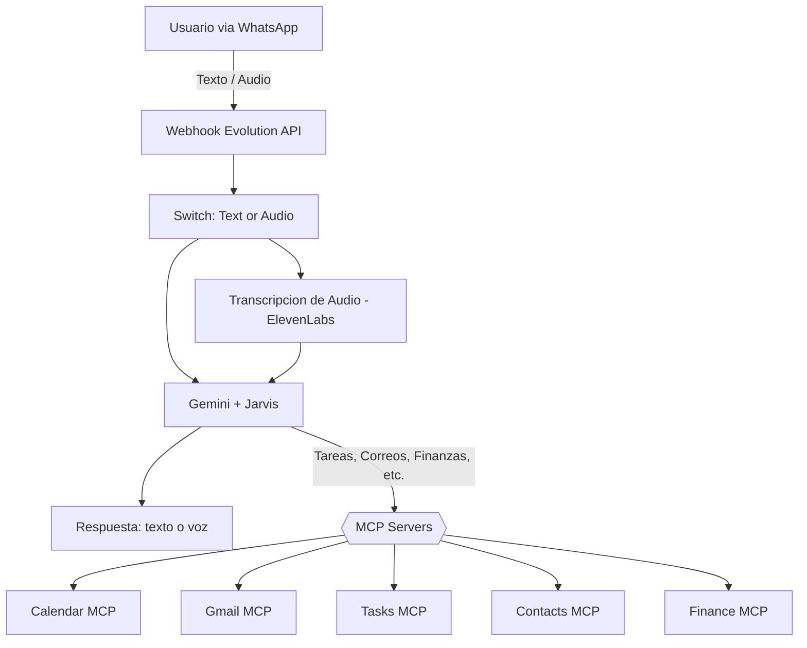

# 🧠 Jarvis — Asistente Personal Inteligente IA

**Jarvis** es un asistente personal impulsado por **IA** y construido sobre **n8n**, que orquesta tareas, correos electrónicos, calendario, contactos y finanzas, todo controlado desde **WhatsApp** mediante **Evolution API**.  
Utiliza **Gemini**, **ElevenLabs**, y el estándar **MCP (Model Context Protocol)** para razonar, recordar y ejecutar acciones automáticamente sobre tus herramientas diarias.

---

## 📸 Vista general del flujo

> 🗂️ Archivo del flujo: `workflows/SUPER JARVIS TARNOWSKI.json`


---

## 🧩 Arquitectura general

> Si GitHub no renderiza el diagrama, probá con la **versión ASCII-safe** más abajo.


<details>
<summary>Versión ASCII-safe (sin acentos ni paréntesis en etiquetas)</summary>


</details>

---

## 🚀 Características principales

| Módulo | Descripción | Integraciones |
|--------|--------------|---------------|
| **Gmail MCP** 📧 | Lee, envía, etiqueta y redacta correos con formato HTML profesional. | Gmail API + MCP |
| **Calendar MCP** 📅 | Crea, reprograma, elimina y consulta eventos. Verifica disponibilidad antes de agendar. | Google Calendar API |
| **Tasks MCP** ✅ | Crea, completa o elimina tareas con seguimiento y notas. | Google Tasks |
| **Contacts MCP** 👥 | Accede a tu lista de contactos para obtener correos o teléfonos automáticamente. | Google Contacts |
| **Finance MCP** 💵 | Registra, obtiene y borra gastos en tiempo real desde Google Sheets. | Google Sheets |
| **ElevenLabs** 🎙️ | Convierte texto a voz y transcribe audios recibidos. | ElevenLabs Speech API |
| **Gemini AI** 🧠 | Motor de razonamiento principal de Jarvis para comprender contexto y ejecutar acciones. | Google Gemini |
| **Evolution API** 💬 | Interfaz de entrada/salida por WhatsApp. Jarvis responde con texto o audio. | EvolutionAPI |

---

## ⚙️ Requerimientos técnicos

### Dependencias
- n8n ≥ 1.72.0 (queue mode recomendado)
- Docker + Docker Compose
- Proxy reverso (Traefik / Nginx) con HTTPS
- PostgreSQL y Redis
- Evolution API (instancia de WhatsApp)
- Google Cloud APIs: Gmail, Calendar, Tasks, Sheets, Contacts
- ElevenLabs API Key
- Gemini API Key (PaLM / Vertex)

### Credenciales (IDs sugeridos en n8n)
- `GMAIL TARNOWSKI` (gmailOAuth2)  
- `GOOGLE CALENDAR TARNOWSKI` (googleCalendarOAuth2Api)  
- `GOOGLE TASKS TARNOWSKI` (googleTasksOAuth2Api)  
- `GOOGLE CONTACTS TARNOWSKI` (googleContactsOAuth2Api)  
- `tarnowski sheets` (googleSheetsOAuth2Api)  
- `ELEVENLABS APIKEY TARNOWSKI` (elevenLabsApi)  
- `GEMINI TARNOWSKI` (googlePalmApi)  
- `EVOLUTION TARNOWSKI` (evolutionApi)

> Guardá los JSON OAuth en `/credentials/` (no los subas al repo).

---

## 🧱 Estructura de carpetas recomendada

```
jarvis-assistant/
├── workflows/
│   └── SUPER JARVIS TARNOWSKI.json
├── assets/
│   ├── screenshots/
│   │   ├── workflow-diagram.png
│   │   ├── gmail-mcp.png
│   │   ├── calendar-mcp.png
│   │   ├── tasks-mcp.png
│   │   ├── finance-mcp.png
│   │   ├── whatsapp-interaction.png
│   │   └── elevenlabs-response.png
│   └── logos/
├── docs/
│   ├── setup-guide.md
│   ├── credentials.md
│   └── api-integrations.md
├── .env.example
├── README.md
└── LICENSE
```

---

## 💬 Ejemplos de interacción

| Mensaje | Acción |
|--------|--------|
| “¿Qué reuniones tengo hoy?” | Devuelve eventos del día desde Calendar. |
| “Agregá una tarea para mañana.” | Crea una tarea en Tasks con due date. |
| “Enviá un correo a Nicole con el resumen.” | Busca contacto en Contacts, redacta y envía por Gmail. |
| “Gasté 45 en café.” | Registra gasto en Sheets. |
| “Mandame un audio con eso.” | Convierte la respuesta a voz con ElevenLabs. |

---

## 🧾 Screenshots sugeridos

- `assets/screenshots/workflow-diagram.png` – Diagrama general de n8n.  
- `assets/screenshots/gmail-mcp.png` – Ejemplo de correo enviado/etiquetado.  
- `assets/screenshots/calendar-mcp.png` – Evento creado automáticamente.  
- `assets/screenshots/tasks-mcp.png` – Lista de tareas generada.  
- `assets/screenshots/finance-mcp.png` – Hoja de gastos actualizada.  
- `assets/screenshots/whatsapp-interaction.png` – Conversación real con Jarvis.  
- `assets/screenshots/elevenlabs-response.png` – Respuesta en audio.  

---

## 👨‍💻 Autor

**Tarnowski Tobías** — Posadas, Misiones 🇦🇷

---

## 🧾 Licencia

MIT
